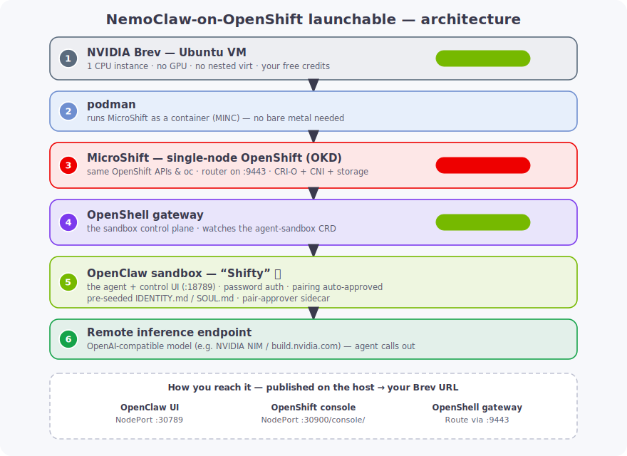

# NemoClaw on MicroShift — Brev Launchable (Red Hat workshop)

A [Brev Launchable](https://docs.nvidia.com/brev/concepts/launchables) that stands up the
full stack on **one CPU instance** — no nested virtualization, no local GPU, no Red Hat
subscription:

```
Brev VM-mode launchable (Ubuntu 22.04)
  └─ podman  ──  MINC: MicroShift in Container (OKD build of Red Hat's lightweight OpenShift)
       ├─ local-path-provisioner (default StorageClass — MINC ships none)
       ├─ agent-sandbox CRD + controller (sandboxes.agents.x-k8s.io)
       ├─ OpenShell gateway (Helm chart, in-cluster = Kubernetes compute driver)
       │    └─ exposed via OpenShift Route (passthrough TLS)
       └─ OpenClaw agent (agent-sandbox Sandbox pod, policy-governed)
            ├─ model ──►  REMOTE custom OpenAI-compatible inference endpoint
            └─ gateway endpoint :18789 exposed via OpenShift Route (edge TLS)
```



The setup script runs the phases in `scripts/` in order:
preflight → host deps → MicroShift (MINC) → OpenShell → OpenClaw Sandbox + Routes
→ host NodePort forwarder → OpenShift console.

> ✅ **Verified end-to-end on a Brev `n2d-highmem-4` (4 vCPU / 31 GB / Ubuntu 22.04, no `/dev/kvm`):**
> MINC brings up MicroShift `4.19.0-okd-scos.17` (k8s v1.32.8); the OpenShell chart
> (`helm-chart:0.0.69`) installs via the **official OpenShift method** and its k8s compute driver
> runs healthy; OpenClaw deploys as an agent-sandbox pod wired to a remote custom endpoint and a
> real agent turn returns a completion from the remote model.
>
> **Four fixes the docs omit but MicroShift-on-a-cloud-VM needs** (all baked into the scaffold):
> 1. **Clamp the MINC node MTU to 1400** (`MINC_NODE_MTU`, phase 20) — the node's `eth0`
>    defaults to 1500 but cloud egress is smaller (GCP `ens4`=1460) with blackholed PMTU
>    discovery, so the **3.3GB OpenClaw image** stalls mid-layer with `unexpected EOF` (small
>    images pull fine). At MTU 1400 the same pull completes in ~30s. *This was the #1 gotcha.*
> 2. **MINC requires podman**, not Docker (its read-only overlay breaks nested CRI-O's layer store).
> 3. **SCC for the gateway + certgen-hook SAs**, not just `openshell-sandbox` — else the
>    pre-install certgen Job never schedules (`job openshell-certgen failed: DeadlineExceeded`).
> 4. **`server.sandboxJwt.secretDefaultMode: "0444"`** — the nulled securityContext makes the
>    gateway run as a random UID that can't read the `0400` JWT key Secret → crash-loop without this.

> ℹ️ Two OpenClaw paths exist. This launchable uses the **gateway-in-OpenShift** path
> (`45-openclaw.sh`): OpenClaw runs as an agent-sandbox pod *in the cluster*. The alternative
> `40-nemoclaw.sh` runs the standard `nemoclaw onboard`, which spins its **own** k3s-in-Docker
> gateway on the host (not in OpenShift) — kept in the repo for reference, not in `setup.sh`.

---

## Why this shape

This is a Red Hat workshop, so we want the genuine **OpenShift `oc` experience** on a
single node. Full OpenShift (SNO / OpenShift Local) needs bare metal or **nested
virtualization**, which this Brev instance doesn't have. The only OpenShift-family option
that fits is **MicroShift** — and since the Brev host is Ubuntu (MicroShift's Red Hat build
is RHEL-only), we use **[MINC](https://github.com/minc-org/minc)**, the OKD/CentOS-Stream
build that runs MicroShift *as a container* on any host. Same OpenShift APIs and `oc`
workflow, no subscription, no nested virt.

Because inference is a **remote endpoint**, there's no GPU on the cluster — so you can use a
cheap **CPU** Brev instance and skip the GPU Operator entirely.

**What this is (and isn't):** this stack is **OpenShell + OpenClaw on OpenShift**. NemoClaw
itself is a reference layer (CLI + blueprint + policies) with **no gateway of its own** — the
gateway *is* OpenShell's. The `nemoclaw` CLI is **not used** here: its `onboard` is hardwired
to run OpenShell as k3s-in-Docker off-cluster, with no flag to target an OpenShift cluster
(this is what issue #407 tried, then dropped as "no longer needed" once the Helm/CRD path
became the official OpenShift story). Two things are called "gateway", don't conflate them:

| "Gateway" | Port | Role |
|-----------|------|------|
| **OpenShell gateway** | 8080 | sandbox control plane (= "NemoClaw's gateway") |
| **OpenClaw gateway**  | 18789 | the agent's own control UI, inside the sandbox |

The OpenClaw agent runs under a **deny-by-default policy** at two layers:
- **L4 (enforced here):** a Kubernetes `NetworkPolicy`
  ([`manifests/openclaw/openclaw-networkpolicy.yaml`](manifests/openclaw/openclaw-networkpolicy.yaml))
  allows DNS + intra-cluster + external HTTPS only; everything else is blocked. Verified on
  this cluster's CNI. Set `OPENCLAW_OPEN_SANDBOX=true` to skip it for an open demo.
- **L7 (reference):** OpenShell's per-binary/method/path schema in
  [`policies/`](policies/) (YAML + JSON) — enforced only when OpenClaw runs under OpenShell's
  supervisor, not for the vanilla agent-sandbox pod.

> ⚠️ Note: OpenShell's Kubernetes compute driver is flagged *alpha, single-player* upstream,
> and MINC is the community OKD build (not the Red Hat subscription build). Both are ideal
> for a workshop; neither is a supported production posture.

## Recommended Brev instance

| Resource | Minimum | Recommended |
|----------|---------|-------------|
| vCPU | 4 | **8** |
| RAM  | 8 GB | **16 GB** |
| Disk | 40 GB | **80 GB+** |
| GPU  | none | none (inference is remote) |
| Runtime mode | **VM mode** (Ubuntu 22.04) | VM mode |
| Nested virt | not needed | not needed |

## Supplying variables & the policy in the Launchable

**There is no per-launch text-field form in the Brev UI** for end-users to type arbitrary
values. The Launchable wizard's user-facing inputs are limited (GPU, disk, name). What Brev
*does* give the **creator** is a **Launchable environment configuration** — env vars set at
creation time and injected into the instance (the NemoClaw docs use this for `CHAT_UI_URL`,
`VSCODE_PASSWORD`, etc.). So:

| What | How to supply it |
|------|------------------|
| Inference vars (`NEMOCLAW_INFERENCE_BASE_URL`, `NEMOCLAW_MODEL`) | Set as env vars in the **Launchable environment configuration** (creator-set). |
| API key (`NEMOCLAW_API_KEY` / `NEMOCLAW_PROVIDER_KEY`) | Same place, marked as a **secret** — never bake it into the repo or script. |
| The policy YAML/JSON + manifests | **Baked into the Git repo** the Launchable clones — no UI input needed; the setup script applies them. |

The scripts read these straight from the environment, so on Brev **no `.env` file is needed** —
the env-config vars are already exported. `.env` is only the **local-dev** fallback:

```bash
cp .env.example .env   # local dev only; on Brev set these in the Launchable env config
```

If you want a genuine *text-field* UX for end-users (e.g. to paste their own endpoint/key),
the practical options are: (a) include a **Jupyter notebook** with an input cell that writes
`.env` then runs `setup.sh`, or (b) have them paste into the shell after launch. Neither is a
native Launchable wizard field.

No Red Hat pull secret or subscription is required (MINC uses community images).

## Ports to expose in the Launchable wizard

| Port | Purpose |
|------|---------|
| 9443 | MicroShift router HTTPS (MINC default) — serves the OpenShell + OpenClaw Routes |
| 9080 | MicroShift router HTTP (MINC default) |
| 6443 | MicroShift API server |
| 3000 | Workshop website — interactive lessons + live shell |
| 30789 | OpenClaw UI — host NodePort (DNS-free, served at `/`), published by phase 50 |
| 30900 | OpenShift/OKD console — host NodePort (served at `/console/`), published by phase 50 (optional, needs phase 60) |
| 30808 | OpenShell gateway NodePort — used by the in-browser lab shell's `openshell` CLI |
| 30030 | Grafana — optional monitoring phase |

OpenClaw UI/endpoint and the OpenShell gateway are reached via their **OpenShift Routes**
through the router's published `:9443` (e.g. `https://openclaw-openclaw.apps.127.0.0.1.nip.io:9443`).

The router only publishes `9080/9443/6443` out of the MINC container; NodePorts live on
the node *inside* it. Phase 50 (`scripts/50-expose-nodeports.sh`, run by `setup.sh`)
installs a self-healing systemd forwarder (`minc-nodeport-forward.service`) that publishes
the NodePorts on the host so they're reachable via a Launchable/Brev URL. Reach them at
`http://<host>:30789/` (OpenClaw) and `http://<host>:30900/console/` (console). Tune via
`NODEPORT_FORWARDS` / `NODEPORT_BIND_ADDR` in `.env` (bind `127.0.0.1` to restrict the
unauthenticated console to loopback/SSH tunnels).

### Login UX

- **OpenClaw Control UI**: a single **fixed password** (`OPENCLAW_GATEWAY_PASSWORD` in `.env`,
  default `openclaw`) — the gateway runs `--auth password`. The first browser also needs
  one-time **device pairing**, approved from the lab shell with
  `openclaw devices list` / `openclaw devices approve <REQUEST_ID>`. (The password is supplied
  via the `OPENCLAW_GATEWAY_PASSWORD` env, not `--password-file` — secret volumes mount as
  symlinks, which OpenClaw rejects.)
- **OpenShift console**: no login (`--user-auth=disabled`). The bridge needs a static user token
  even when auth is disabled, so a non-expiring `console-sa-token` Secret is injected as
  `BRIDGE_K8S_AUTH_BEARER_TOKEN` (cluster-admin) — without it the UI shows "configure authentication".

## Usage

As a Brev Launchable **setup script**:

```bash
cd nemoclaw-openshift-launchable
cp .env.example .env     # fill in the remote-endpoint vars (or inject via Brev secrets)
./scripts/setup.sh
```

Run phases individually for debugging — see [`scripts/`](scripts/).

## Teardown

```bash
sudo minc delete        # remove the MicroShift container
helm -n openshell uninstall openshell
```

## References

- [Brev Launchables](https://docs.nvidia.com/brev/concepts/launchables)
- [MINC — MicroShift in Container](https://github.com/minc-org/minc) · [MicroShift](https://github.com/openshift/microshift)
- [NemoClaw](https://github.com/NVIDIA/NemoClaw) · [OpenShell](https://github.com/NVIDIA/OpenShell) · [Helm chart README](https://github.com/NVIDIA/OpenShell/blob/main/deploy/helm/openshell/README.md)
- [NemoClaw on OpenShift (issue #407)](https://github.com/NVIDIA/NemoClaw/issues/407)
